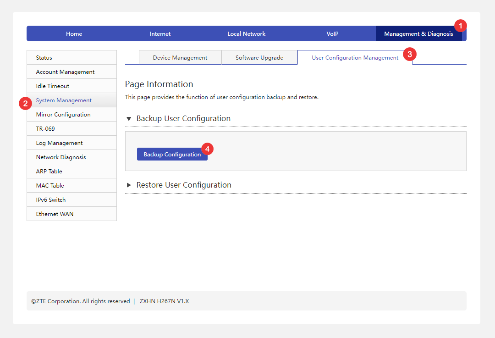

# HOW?

Open your router (ZTE) Admin interface (e.g. at [192.168.1.1](http://192.168.1.1)).  

* Enter Username & Password.
* Login.
* Management & Diagnosis **>** System Management **>** User Configuration Management **>** **Backup Configuration**.
* Save the file **config.bin**.
* Open **Ratr.exe** & load the saved **config.bin**.

## Screenshot

