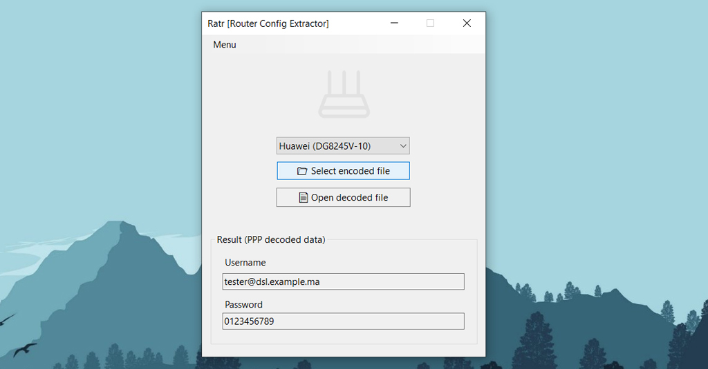

# Ratr

Router Config Extractor (GUI).

- Extract **PPP** hidden/encoded password to be used in personal router (Home gateway).
- Decode configuration file (**root** & **admin** password hashes).
- Security: Avoiding default router from your ISP or Possible malwares in custom firmwares.
- Bypass **TR069** management parameters.
- Automated **config file** decoder (No python scripting required!).
- Educational purposes (Analyse parameters).

## Screenshot:

## Requirements:

- [**.NET Desktop Runtime**](https://dotnet.microsoft.com/en-us/download/dotnet/thank-you/runtime-desktop-6.0.23-windows-x64-installer) ^6.x (Used in Runtime)
- [**Git for Windows**](https://git-scm.com/downloads/win) (Used to generate decoders)
- **Visual Studio 2022** ^17.x (Used to build Ratr)

## Teseted:

- [Huawei DG8245V-10](https://www.manualslib.com/manual/2439878/Huawei-Dg8245v.html)
- [ZTE ZXHN H267N](https://www.manualslib.com/products/Zte-Zxhn-H267n-6917102.html)
- [[See more...]](./Compatibility.md)

## Decoders:

- [Hwdecode](https://github.com/Jakiboy/Hwdecode) (Huawei)
- [Ztedecode](https://github.com/Jakiboy/Ztedecode) ([ZTE config utility](https://github.com/mkst/zte-config-utility))
- [AES encryption](https://pypi.org/project/pycryptodomex/)

## Download:

**Windows binary** (No setup)

- [Releases](https://github.com/Jakiboy/Ratr/releases)

**Routers config examples**

- [Huawei DG8245V-10 config example](https://github.com/Jakiboy/Ratr/raw/refs/heads/main/config/Huawei-DG8245V-10.example.xml)
- [ZTE ZXHN H267N config example](https://github.com/Jakiboy/Ratr/raw/refs/heads/main/config/ZTE-ZXHN-H267N.example.bin)
- [[See more...]](./config)

## Docs:

- [How to export "Huawei DG8245V-10" router data (config)?](./docs/Huawei-DG8245V-10-Export.md)
- [How to fix "Huawei DG8245V-10" router configuration (DSL)?](./docs/Huawei-DG8245V-10-Config.md)
- [How to export "ZTE ZXHN H267N" router data (config)?](./docs/ZTE-ZXHN-H267N-Export.md)

---

> [!CAUTION]
> Decoders have been flagged as a potential threat by antivirus software (Microsoft Defender). The files are safe to use. You may also build them from the source if preferred.
