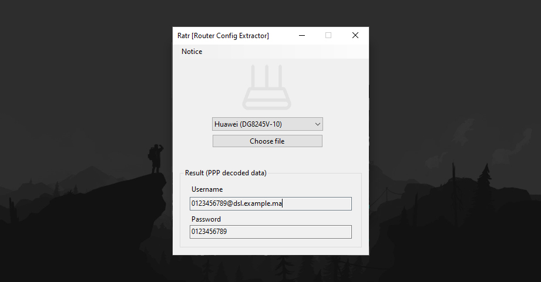

# Ratr

Router Config Extractor (GUI).  

* Extract **PPP** hidden password to be used in personal router.
* Security: Avoiding default router from your ISP & Possible malwares in custom firmwares.
* Bypass **TR069** management parameters.
* Automated **config file** decoder (No python scripting required!).
* Educational purposes (Analyse parameters).

## Requirements:

* [**.NET Desktop Runtime**](https://dotnet.microsoft.com/en-us/download/dotnet/thank-you/runtime-desktop-6.0.23-windows-x64-installer) ^6.x

Used to build Ratr:

* **Visual Studio 2022** ^17.x

## Teseted:

* **ZTE ZXHN H267N** ^1.x
* **Huawei DG8245V-10** ^1.x

## Decoders:

* [Ztedecode](https://github.com/Jakiboy/Ztedecode) ([ZTE config utility](https://github.com/mkst/zte-config-utility))
* [Hwdecode](https://github.com/Jakiboy/Hwdecode) (Huawei)
* [AES encryption](https://pypi.org/project/pycryptodomex/)

## Download

**Windows only** (No setup)

* Download from: [Releases](https://github.com/Jakiboy/Ratr/releases)
* [ZTE config example](https://github.com/Jakiboy/Ratr/raw/refs/heads/main/.static/zte.example.bin)
* [Huawei config example](https://github.com/Jakiboy/Ratr/raw/refs/heads/main/.static/huawei.example.xml)

## Docs

* [How to export router data ?](https://github.com/Jakiboy/Ratr/blob/main/How.md)
* [Fix router configuration](https://github.com/Jakiboy/Ratr/blob/main/Config.md)

## Screenshot

---

> [!CAUTION]
> Decoders have been flagged as a potential threat by your antivirus software. This is a false positive, and the files are safe to use. You can build them from the source.
