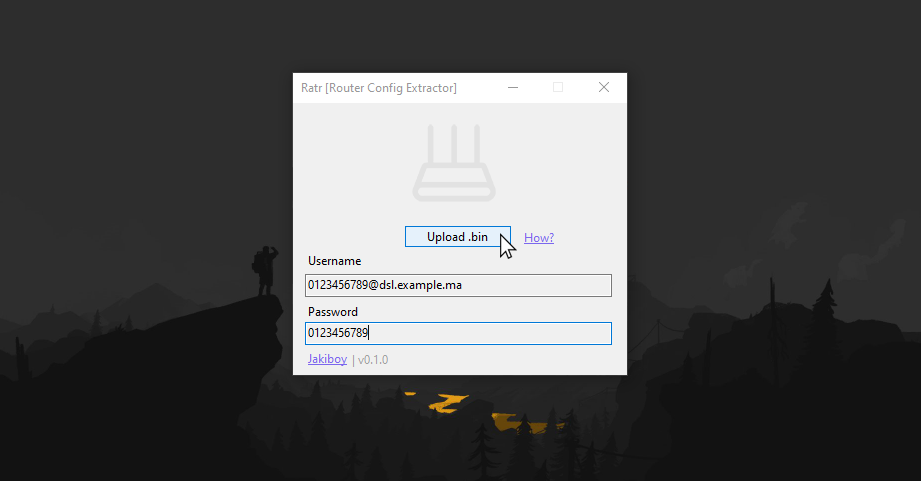

# Ratr

ZTE Router Config Extractor (GUI).  

* Extract **PPP** hidden password to be used in personal router.
* Security: Avoiding default router from your ISP & Possible malwares in custom firmwares.
* Bypass **TR069** management parameter.
* Automated **binary file** decoder (No python scripting required!).
* Educational purposes (Analyse parameters).

## Requirements:

* [**.NET Desktop Runtime**](https://dotnet.microsoft.com/en-us/download/dotnet/thank-you/runtime-desktop-6.0.23-windows-x64-installer) ^6.x.

Used to build Ratr:

* **Visual Studio 2022** ^17.x.

## Teseted:

* **ZTE ZXHN H267N** ^1.x.
* **Huawei DG8245V-10** ^1.x.

## Decoder:

* Python script [ZTE config utility](https://github.com/mkst/zte-config-utility), Using AES encryption [pycryptodomex](https://pypi.org/project/pycryptodomex/).

## Download

**Windows only** (No setup)

* Download from: [Releases](https://github.com/Jakiboy/Ratr/releases).

## Screenshot

---

## Authors:

* **Jihad Sinnaour** - [Jakiboy](https://github.com/Jakiboy) (*Initial work*)

## ⭐ Support:

Please give it a Star if you like the project.
