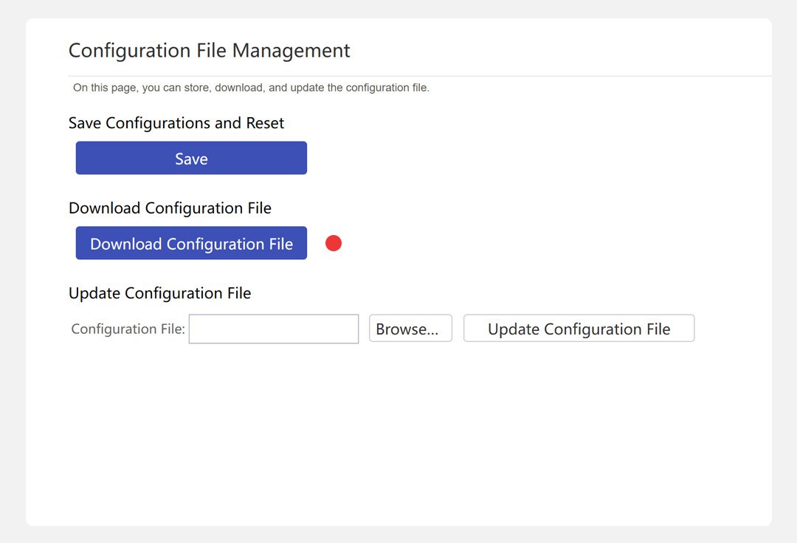

# Export "Huawei DG8245V-10" router data (config)

Open your router (Huawei) Admin interface (e.g. at [192.168.1.1](http://192.168.1.1)).  

* Login using your Username & Password.
* Keep dashboard open & open a new tab with http://192.168.1.1/html/ssmp/cfgfile/cfgfile.asp
* Show hidden elements with Javascript using console.

```
$('[style="display:none"]').removeAttr('style');
```

* Download configuration file **config.xml**.
* Open **Ratr** choose **Huawei (DG8245V-10)** & load the saved **config.xml**.

## Screenshot

[](#)