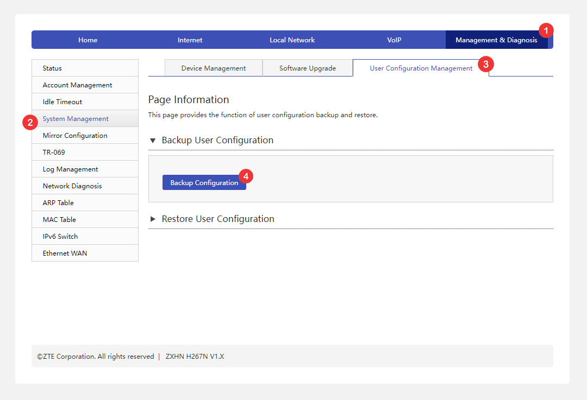

# Export "ZTE ZXHN H267N" router data (config)

Open your router (ZTE) Admin interface (e.g. at [192.168.1.1](http://192.168.1.1)).  

* Login using your Username & Password.
* Management & Diagnosis **>** System Management **>** User Configuration Management **>** **Backup Configuration**.
* Save the file **config.bin**.
* Open **Ratr** choose **ZTE (ZXHN H267N)** & load the saved **config.bin**.

## Screenshot

